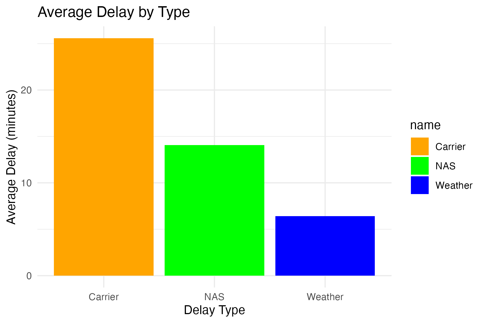
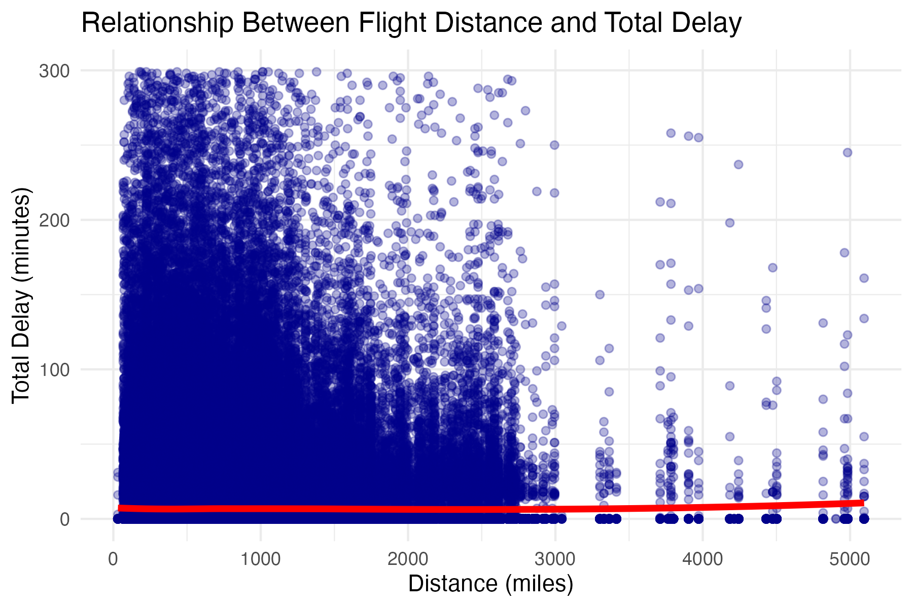
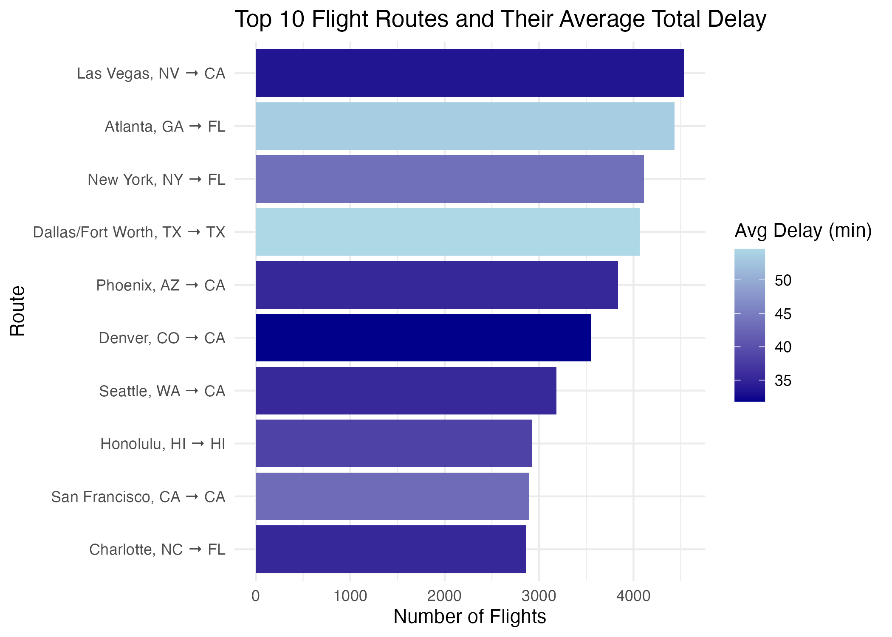

## Introduction

Flights delay has been a common phenomenon that affects current air transportations and reduces their efficiency as well as quality of service provided by airlines. The causes of flight delays include airline operation, weather problems, and air traffic controller issues.

To improve airline efficiency and develop scheduling systems, it is necessary to study the factors which contribute to flight delays. This project utilizes the methodology of exploratory data analysis in order to understand relationships between elements of flight delays.

There are two main research questions that will be analyzed in this project:

1.  What are the main factors which cause flight delays?
2.  How does the flight distance impact flight delays?

## Data Provenance

In this analysis, the data are obtained from the United States' flight performance data submitted by airlines to the BTS. The data are collected by the federal government as part of the monitoring process of performance in airlines.

Every record in the data set is about a particular flight, and comprises several columns for each variable related to delay. The variables are categorized into different types of delays depending on the cause of each delay.

<https://www.transtats.bts.gov/DL_SelectFields.aspx?gnoyr_VQ=FGJ&QO_fu146_anzr=b0-gvzr&fbclid=PAVERFWARma_hleHRuA2FlbQIxMABzcnRjBmFwcF9pZA8xMjQwMjQ1NzQyODc0MTQAAafEXA4UPbALvkdx839ZPd5A9aghZYfWRMU33PdYtBtm579RqsH_-p2s79yrtw_aem_nEKP0Xn6Fb0t3D96pRSmIA>

citation: Download Page - transtats.bts.gov. (n.d.). https://www.transtats.bts.gov/DL_SelectFields.aspx?gnoyr_VQ=FGJ&QO_fu146_anzr=b0-gvzr 
This website is the data source for our current project.

## Fair and Care

This data set meets all of the FAIR principles.

It is "Findable and Accessible" because the data can be freely obtained from government sources. Interoperability is met by the fact that the data is organized in a tabular manner and has proper labeling of variables. In terms of CARE principles, there are no issues associated with the presence of any personal information, hence no privacy issues. Nevertheless, using the data requires us to be clear about our intentions. The challenge here is to avoid moving from mere analysis to comparison.

## Case & Attributes

A case represents an individual flight in the present dataset.

This data set contains some important variables that can be used for studying the delays: - DISTANCE: The flight distance measured in miles; it depends on the trip scale. - CARRIER_DELAY: The delay caused by airlines' activities like maintenance and takeoffs. - WEATHER_DELAY: The delay happened because of bad weather conditions. - NAS_DELAY: The delay caused by problems with the National Airspace System.

In addition, "total_delay" is an indicator of the total delay and a key variable in our analysis.

These variables allow us to examine both individual factors and their interrelations.

## Data Import and Cleaning

Flight dataset was uploaded to R Studio and cleaned prior to data analysis. There are multiple variables contained within the flight dataset, among which are the flight-related ones, as well as airport codes and distances between two airports. There are also delay categories provided.

As a first step in preparation, we had to identify those variables that will be relevant to our study. Given that the reasons for delays and connections between delays and distance are of interest to us, it was decided to retain "DISTANCE", "CARRIER_DELAY", "WEATHER_DELAY", and "NAS_DELAY". For conducting an analysis of routes, we will use "ORIGIN_AIRPORT_ID" and "DESTINATION_AIRPORT_ID".

By far, the hardest part of cleaning the dataset is working with the missing values in delay variables. The thing is that for flight delay dataset, the use of missing values means that there is no delay in a particular delay category. Therefore, in order to calculate the total of delays, missing values in the "CARRIER_DELAY", "WEATHER_DELAY", and "NAS_DELAY" columns have been replaced by 0s. As such, we were able to preserve majority of the information in the dataset without losing the meaning of delay categories.

The next step involved creating a "total_delay" variable out of the aforementioned delay variables. This way, we could explore the pattern of delays more comprehensively.

The last step required verifying whether our chosen variables were properly formatted.

## Descriptive Statistics

The descriptive statistics were determined in order to give an idea about the measures of central tendency and dispersion regarding flight delays.

Based on the results, the average total delay is relatively low, but the distribution is highly skewed, with a small number of flights experiencing extremely large delays.This indicates high variability in delay outcomes, where most flights have minor delays but a few extreme cases significantly increase the average delay.

Hence, the presence of such skewness underlines the necessity to take into account both the average and the median value in interpretation of the obtained data.

## Types of Delay Analysis

In order to better determine the causes of the flight delay, the mean delay for each type of delay was calculated.

It can be seen in "Figure 1" that carrier delay is the major contributor of all kinds of delays, followed by NAS delay and weather delay being the lowest contributors of all.




Figure 1 shows that carrier delay has the highest average value among all delay types.

This indicates a strong pattern where airline related factors dominate delay causes. While weather and NAS delays contribute, their average values are significantly lower.

This suggests that internal airline operations, such as scheduling and maintenance, play a more consistent role in causing delays.

## Distance vs Total Delay

The analysis of how flight distance is correlated with total delay was done with the help of the scatter diagram.



Base on Figure 2, a significant number of flights occur at the lower range of distance, especially below 1,500 miles. In this range, delays are fairly small; however, there is a wide range of variability, as there are quite a few cases when a flight is delayed for a long time even at shorter distances.


Thus, the existence of outliers demonstrates that short distance does not prevent from having high delays. Thus, other factors seem to play a more influential role.

Finally, a very flat trend line means that correlation between distance and delay is very weak. This implies that the distance itself does not have much of an effect on the phenomenon under consideration.


## Top Routes Analysis



Figure 3 shows the top 10 most common flight routes in the dataset.

There is a clear pattern where flights are highly concentrated in a small number of routes, indicating that air traffic is unevenly distributed across the network. Some of these high-traffic routes also display higher average delays, suggesting that congestion and operational demand may contribute to delays.

In addition, there is noticeable variability in average delay across routes. Even routes with similar flight counts can experience different delay levels, which indicates that delay is not determined by traffic volume alone. Other factors, such as airline operations, scheduling efficiency, and airport conditions, may also play important roles.

Overall, this visualization supports the idea that flight delays are influenced by multiple interacting factors rather than a single cause.

## Discussion

This report shows several key insights.

First, delays caused by carriers seem to have the largest effect on total delays, which shows that operation is an important part of the problem. Second, the correlation between distance and delay seems to be low, meaning that longer flights are not likely to be more delay-prone than shorter ones. Third, delay problems are the results of interactions of several variables, not just one.

So, these conclusions show that flight delay processes are quite complicated.

## Other Insights

Apart from the main analysis, there are some additional patterns in the dataset.

The first pattern shows that there is a considerable impact of extreme events on the delay. Although this has a very low impact on the average value of the variable, there are some flights that suffer extremely long delays.

The second pattern indicates that the delay varies more for short distances. It means that flights over shorter distances can be affected by some disturbances, including poor scheduling and congested airports.

Lastly, the pattern of delay types indicates that there is no single cause for delays. They usually result from a combination of several factors.

## Reflection

Through this analysis, it is clear why using exploratory data analysis to investigate complex phenomena in the real world is so important.

Instead of just summarizing data using descriptive statistics, visualizations and distribution helped give insight into the nature of delays. This is because knowing whether delays have a skewed and varying distribution gave additional information beyond what simple descriptive statistics could provide.

Finally, it is evident from the work completed during the project that attention should be paid to data cleaning when doing an investigation because certain decisions affect the outcome.

In conclusion, through the completion of this analysis, it can be seen why analyzing relationships, trends, and variance in data is so important.

## Author Contributions

Shang-Hsuan Huang contributed to data visualization, including generating plots and interpreting results (with help from Tianyu).

Tianyu Duan contributed to writing the report and structuring the QMD document (with help from Shang-Hsuan).

## Code Appendix
```{r}
#| echo: true
#| message: false
#| warning: false

# Style Guide: Tidyverse Style Guide
# Primary author: Shang-Hsuan Huang
# Reviewer: Tianyu Duan

# This analysis follows an exploratory data analysis (EDA) approach
library(tidyverse)

df <- read_csv("T_ONTIME_REPORTING 2.csv", show_col_types = FALSE)

# Clean data by keeping variables used in the analysis
df_clean <- df %>%
  select(
    ORIGIN_CITY_NAME,
    DEST_STATE_ABR,
    DISTANCE,
    CARRIER_DELAY,
    WEATHER_DELAY,
    NAS_DELAY
  ) %>%
  filter(!is.na(ORIGIN_CITY_NAME),
         !is.na(DEST_STATE_ABR),
         !is.na(DISTANCE)) %>%
  mutate(
    CARRIER_DELAY = coalesce(CARRIER_DELAY, 0),
    WEATHER_DELAY = coalesce(WEATHER_DELAY, 0),
    NAS_DELAY = coalesce(NAS_DELAY, 0)
  )

# Create total delay and route variables for analysis
df2 <- df_clean %>%
  mutate(
    total_delay = coalesce(CARRIER_DELAY, 0) +
      coalesce(WEATHER_DELAY, 0) +
      coalesce(NAS_DELAY, 0),
    route = paste(ORIGIN_CITY_NAME, DEST_STATE_ABR, sep = " → ")
  )

delay_stats <- df2 %>%
  summarize(
    mean_delay = mean(total_delay, na.rm = TRUE),
    median_delay = median(total_delay, na.rm = TRUE),
    sd_delay = sd(total_delay, na.rm = TRUE),
    min_delay = min(total_delay, na.rm = TRUE),
    max_delay = max(total_delay, na.rm = TRUE)
  )

knitr::kable(delay_stats)

# Summarize delay types to compare causes
delay_summary <- df2 %>%
  summarize(
    Carrier = mean(CARRIER_DELAY, na.rm = TRUE),
    Weather = mean(WEATHER_DELAY, na.rm = TRUE),
    NAS = mean(NAS_DELAY, na.rm = TRUE)
  ) %>%
  pivot_longer(cols = everything())

plot1 <- ggplot(delay_summary, aes(x = name, y = value, fill = name)) +
  geom_col() +
  scale_fill_manual(values = c("orange", "green", "blue")) +
  labs(
    title = "Average Delay by Type",
    x = "Delay Type",
    y = "Average Delay (minutes)"
  ) +
  theme_minimal()

plot1

top_routes <- df2 %>%
  group_by(route) %>%
  summarize(
    flights = n(),
    avg_delay = mean(total_delay, na.rm = TRUE),
    .groups = "drop"
  ) %>%
  arrange(desc(flights)) %>%
  slice_head(n = 10)

plot2 <- ggplot(top_routes, aes(x = reorder(route, flights), y = flights, fill = avg_delay)) +
  geom_col() +
  coord_flip() +
  scale_fill_gradient(low = "darkblue", high = "lightblue") +
  labs(
    title = "Top 10 Flight Routes and Their Average Total Delay",
    x = "Route",
    y = "Number of Flights",
    fill = "Avg Delay (min)"
  ) +
  theme_minimal()

plot2

# Primary author: Tianyu Duan
# Reviewer: Shang-Hsuan Huang

plot3 <- df2 %>%
  filter(!is.na(DISTANCE)) %>%
  filter(total_delay < 300) %>%
  ggplot(aes(x = DISTANCE, y = total_delay)) +
  geom_point(alpha = 0.3, color = "darkblue") +
  geom_smooth(method = "lm", color = "red", linewidth = 1.5, se = FALSE) +
  labs(
    title = "Relationship Between Flight Distance and Total Delay",
    x = "Distance (miles)",
    y = "Total Delay (minutes)"
  ) +
  theme_minimal()

plot3
ggsave("delay_plot.png", plot = plot1, width = 6, height = 4)
ggsave("top_routes_plot.png", plot = plot2, width = 7, height = 5)
ggsave("distance_delay_plot.png", plot = plot3, width = 5, height = 3)

```
